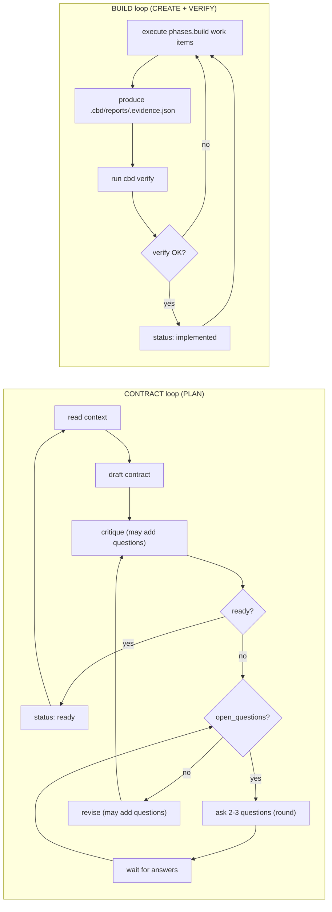

# dbc_agent_kit

This repo is set up for **Contract‑First Development (Design by Contract)** so agent work is **mechanical, not vibes**.

## What this gives you

Two tight loops:



- CONTRACT loop output: `.cbd/contracts/<id>.contract.json` + a build-ready `.cbd/bundles/<id>.bundle.json`
- BUILD loop hard gate: `cargo run --manifest-path xtask/Cargo.toml -- cbd verify --id <id>`

The bundle is the **handoff runbook** from CONTRACT to BUILD.

See:
- `.cbd/README.md` for artifacts and quickstart
- `.cbd/prompts/CONTRACT.md` and `.cbd/prompts/BUILD.md` for canonical agent instructions

## Quickstart

```bash
cargo run --manifest-path xtask/Cargo.toml -- cbd new-task --id 0001 --slug data-orchestration
```
